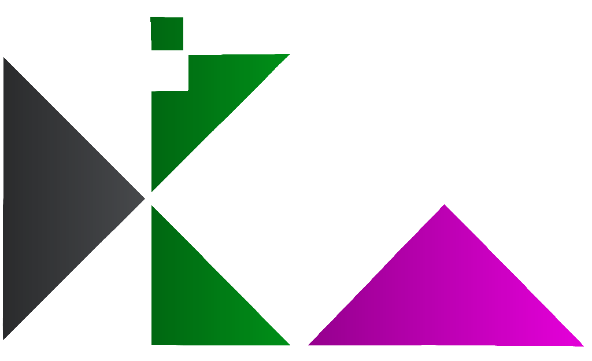
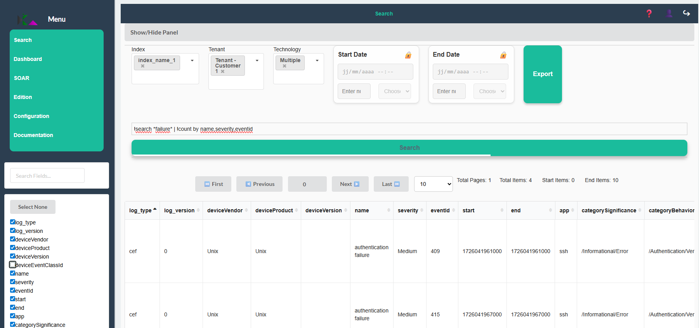
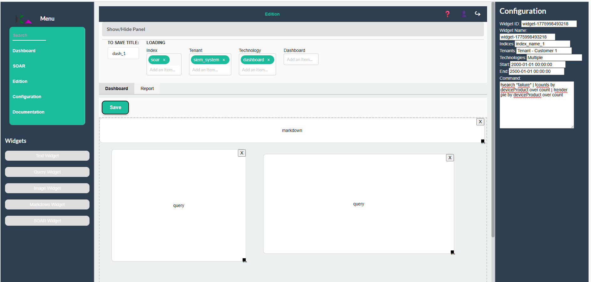
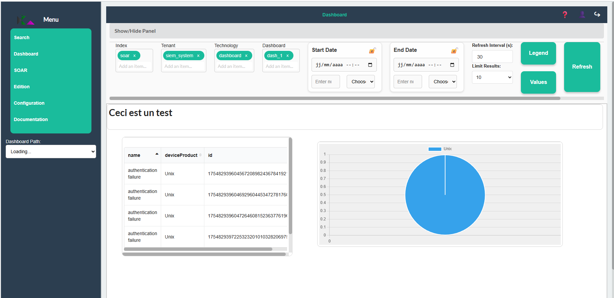
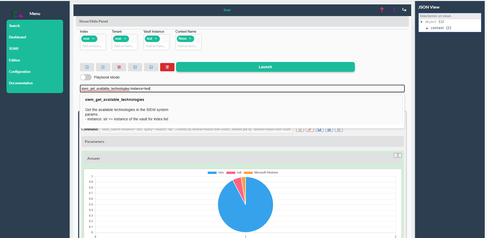
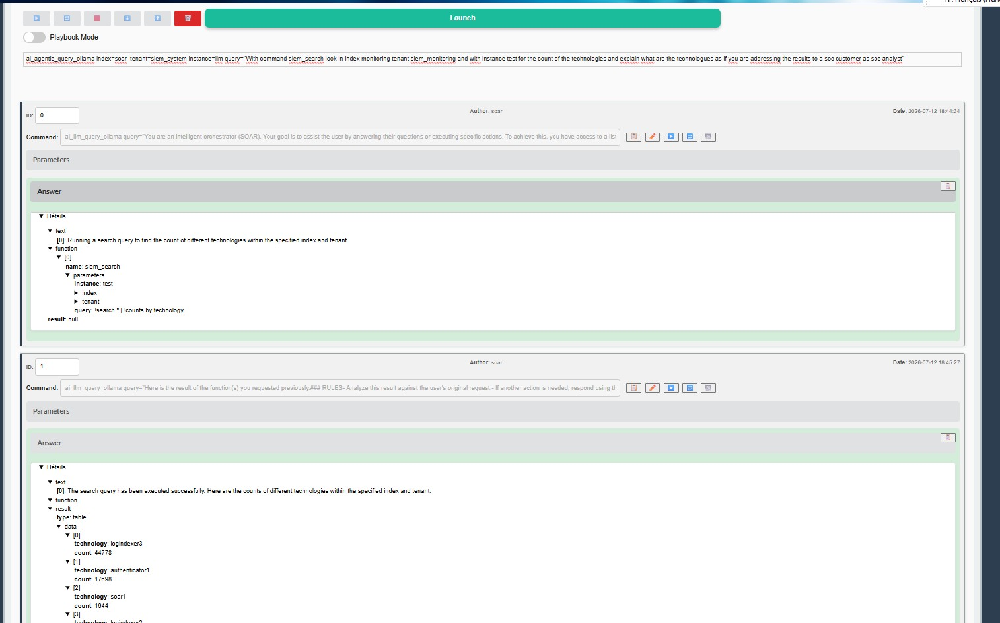
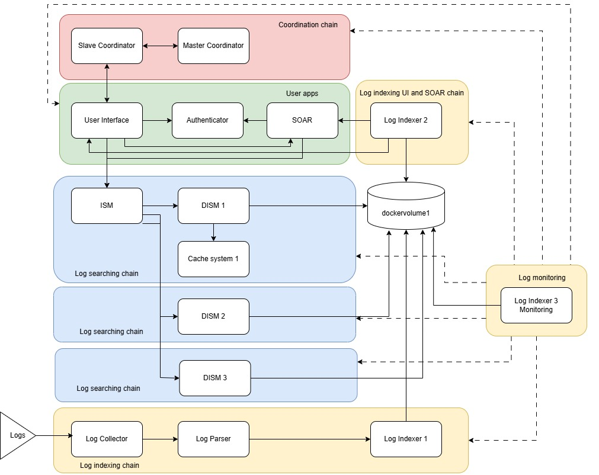
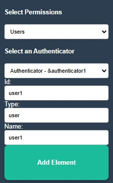
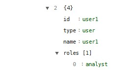

<!-- 
Copyright 2026 ttdantett DevBytesArt®

Licensed under the Apache License, Version 2.0 (the "License");
you may not use this file except in compliance with the License.
You may obtain a copy of the License at

    http://www.apache.org/licenses/LICENSE-2.0

Unless required by applicable law or agreed to in writing, software
distributed under the License is distributed on an "AS IS" BASIS,
WITHOUT WARRANTIES OR CONDITIONS OF ANY KIND, either express or implied.
See the License for the specific language governing permissions and
limitations under the License.

author: ttdantett
title: siem project
document: dockerfile master coordinator
-->

#  DevBytesArt® SIEM Project (DBASP) (Beta Version)

## DBASP

DBASP is a SIEM (Security Information and Event Management) and a SOAR (Security Orchestration and Automation Response) application based on configurable docker container technology for more flexibility and scaling. 

SIEM centralizes and standardizes log data to streamline threat detection and analysis.

SOAR takes action by automating responses, scheduling tasks, and managing security incidents.

## Main Features

The application provides several features such as:

- **Search page**: to display results of researches in logs database in differents formats (table and charts)
- **Dashboard Editor**: to edit dashboard and reports.
- **Configuration Editor**: (only for authorized users), json file with editor helper to configure the SIEM infrastructure.
- **Dashboard page**: to visualize dashboards.
- **SOAR page**: to schedule task, create and launch playbook and automate actions.

### Search page



### Dashboard editor



### Dashboard



### SOAR 



### AI Agentic (beta testing)



## Key Features

This software has some key features:

- DBASP is a docker infrastructure connected on the network to communicate using docker container
- DBASP relies on a Leader/Follower architecture to manage global configuration. The leader node distributes a centralized configuration file to all follower nodes across different machines. Each follower receives only its relevant slice of the configuration, allowing it to provision and initialize its local application components.
- The log parsing and indexing uses pulling and not push to authorize multiple parser and indexer to collect logs from the log collector in order to avoid overloading of the log collector. 
- Logs can be anonymised, filter before or after parsing, parsed, agregated (not implemented yet) and enriched.
- Reading logs are done by one or several dedicated index search motor managed by one index search motor to divide researches and increase search efficiency. 
- DBASP is MSSP (Managed Security Service Provider) due to segregation of indices and tenants and the capability to use several authenticator and user interface. 
- As the components are working using docker container, it can be used in several Operating System, infrastructure (on premises or cloud [Not tested right now]) or even on several customers infrastructure in the same time. Indeed, some container can stay on customer infra and be requested from your infrastructure. 
- DBASP is highly customisable
- DBASP SIEM and SOAR are working together
- SOAR scripts can be added in python in the SOAR
- Search possible on parsed and raw logs
- Indexing before searching on reverse index
- SOAR playbook/context, dashboard and reports are saved in the SIEM (in an index)

Example of log collection and search full chain


Example of MSSP 


## Improvement and roadmap

Some improvements are required to use it in production (not exhaustive list):

- Improve documentation
- Not easy to install and configure. Improve simplicity to do
- Increase search efficiency and speed to do
- Agregation to do
- Search capabilities are now limited. Some operations must be added
- Reporting capabilities to improve 
- SOAR capabilities to improve
- IA Agent to improve
- Propose detection rules and IA capabilities in detection

## Prerequisites

Before running the project, ensure you have the following installed and configured:

Container Engine: Docker or Podman.

Images: Download the required container images:
```
docker pull ttdantett/siem_soar
docker pull ttdantett/siem_authenticator
docker pull ttdantett/siem_indexsearchmotor
docker pull ttdantett/siem_userinterface
docker pull ttdantett/siem_slavecoordinator
docker pull ttdantett/siem_mastercoordinator
docker pull ttdantett/siem_logindexer
docker pull ttdantett/siem_logparser
docker pull ttdantett/siem_logcollector
docker pull ttdantett/siem_dedicatedindexsearchmotor
docker pull ttdantett/siem_cachesystem
```

Security: Valid SSL certificates are mandatory:

server.crt (Certificate)
server.key (Private Key)

```
openssl req -x509 -newkey rsa:4096 -keyout server.key -out server.crt -sha256 -days 365 -nodes
```

Storage disk:
Either local or virtual via docker volume (created before launch the configuration).
Copy the certificates on the docker volume.

Prepare the configuration files for the master and slave coordinators.

Open all the ports required and used by the application (see configuration file). Note that the slave coordinator can be used as reverse proxy and launch actions to the component.

## Installation

Slave coordinator (create component) and master coordinator(configuration file) must be configured correctly on the vm to use it. 

The container slave coordinator must be running before the master coordinator at the first launch as the master coordinator will send the configuration to the slave coordinator. 

In order to launch the slave coordinator use the following command (change with the right parameters).

## Minimal configuration

The minimum of components required are the followings:

- the master coordinator that contains the global configuration files
- the slave coordinator that create container with components (userinterface, log collectors... )
- the user interface that enable the user to access to the gloabl configuration with the correct permissions
- the authenticator that manage the identification, authentication and access permissions

The others components can be created either by change the configuration file of the mastercoordinator or with the user interface.

The master coordinator configuration file contains :
- version
- last_modified
- intfrastructure
-- mastercoordinators list that contains components details
-- slavecoordinators list that contains the list of slave components and details
--- sub-infrastructure that contains all components available in a list with details

&<id> contains the reference of the component. The master will change with component details on the configuration during the configuration change.

**The user siem_system is used as superadmin with the password defined during the launch of the application (by default changeit)**

### Installation slave coordinator

***Find a very basic configuration on the next section "Preconfigured architecture" (Simple localhost full architecture)***

Create the docker dockervolume1
```
docker volume create dockervolume1
```

Add the configuration file on the dockervolume

Create the docket network local
```
docker network create --driver bridge --subnet=192.168.100.0/24 internal_network
```

Launch the command to create the slavecoordinator

```
docker run 
    -v //var/run/docker.sock:/var/run/docker.sock 
    -d --name slavecoordinator1 
    --hostname slavecoordinator1 
    -v dockervolume1:/data/:rw 
    -p 8443:8443 
    --network internal_network 
    --network host 
    --add-host 192.168.0.1:host-gateway 
    -it ttdantett/siem_slavecoordinator 
    python SlaveCoordinator.py 
        -f /data/slavecoordinator_example.json
```

An example of a slave coordinator is available on ["Slave coordinator configuration"](./configuration/slavecoordinator_example.json)

**Change authentication token on the global configuration file**

### Installation master coordinator

```
docker run 
-d 
--name mastercoordinator1 
--hostname mastercoordinator1 
-v dockervolume1:/data/:rw 
-p 6000:6000 
--network internal_network 
--network host 
--add-host 192.168.0.1:host-gateway 
-it ttdantett/siem_mastercoordinator 
python MasterCoordinator.py 
    -f /data/mastercoordinator_example.json -p true -s changeit
```

An example of a master coordinator is available on ["Master coordinator configuration"](./configuration/mastercoordinator_example.json)

### Configuration agent AI (beta version - under testing process)

Use the following command to install ollama in docker and install the qwen model

```
docker run -d -v ollama:/root/.ollama -p 11434:11434 --name ollama ollama/ollama
or 
docker run -d --gpus=all -v ollama:/root/.ollama -p 11434:11434 --name ollama ollama/ollama
```

Add in ollama the network internal_network
```
 docker network connect internal_network ollama
```

Create in the instance of the SOAR the key for the llm
```
vault_set_ollama_credential
```

And finally use simple question to llm with the command:
```
ai_llm_query_ollama
```

Or ask for agentic to launch commands with:
```
ai_agentic_query_ollama
```

## Preconfigured architecture

### Simple node localhost



Create the docker dockervolume1
```
docker volume create dockervolume1
```

Create the docket network local
```
docker network create --driver bridge --subnet=192.168.100.0/24 internal_network
```

Add the configuration files on the dockervolume 
```
- slavecoordinator_example.json
- mastercoordinator_single_full.json
```

Launch the command to create the slavecoordinator

```
docker run 
    -v //var/run/docker.sock:/var/run/docker.sock 
    -d --name slavecoordinator1 
    --hostname slavecoordinator1 
    -v dockervolume1:/data/:rw 
    -p 8443:8443 
    --network internal_network 
    <!-- --network host  -->
    --add-host 192.168.0.1:host-gateway 
    -it ttdantett/siem_slavecoordinator 
    python SlaveCoordinator.py 
        -f /data/slavecoordinator_example.json
```

Launch the command to create the mastercoordinator

```
docker run 
-d 
--name mastercoordinator1 
--hostname mastercoordinator1 
-v dockervolume1:/data/:rw 
-p 6000:6000 
--network internal_network 
<!-- --network host  -->
--add-host 192.168.0.1:host-gateway 
-it ttdantett/siem_mastercoordinator 
python MasterCoordinator.py 
    -f /data/mastercoordinator_single_full.json -p true -s changeit
```

**For security reason, change password of siem_system (currently 'changeit') and create an analyst user**

To change password, go on : **/changepassword** page
And change the user siem_system

In order to use the SOAR.

Go on signup page: **/signup**

On Global privileges page with superadmin user, add the user or service user with the right permissions (permissions restricted according to the user role).



Add the role analyst and validate.



Add the vault for this service user or user with the command (on SOAR page)
```
vault_set_basic_credential id=<name of the instance> username=<user analyst with rights permissions> password=<password>
```

## Documentation

The full documentation is available on the application itself. This documentation explain how components works, how use it as an analyst or administrator.

API documentation is available with swagger from the application. 

## Contributing and Collaboration

Contributions are what make the open-source community such an amazing place. Whether you want to fix a bug, add a feature from the roadmap, or improve the documentation, **your help is highly appreciated!**

### A Quick Note on the Project

**Please note:** I am currently the sole developer maintaining this project, and this is my very first experience managing collaboration on GitHub. 
 
Because of this, I will be handling issues and Pull Requests on a **best-effort basis**. Thank you in advance for your patience and understanding as I learn how to manage an open-source project!

### How to Contribute?

1. **[Fork the project](https://github.com/DevBytesArt®/SIEMProject/fork)**.
2. **Create your feature branch** (`git checkout -b feature/AmazingFeature`).
3. **Commit your changes** (`git commit -m 'Add some AmazingFeature'`).
4. **Push to the branch** (`git push origin feature/AmazingFeature`).
5. Open a **[Pull Request](https://github.com/DevBytesArt®/SIEMProject/pulls)**.

For major changes, please open an issue or a discussion first so we can chat about it and make sure we are aligned.

**New to open-source or GitHub?** Me too! Don't hesitate to jump in, we can learn and improve this project together.

### Need Help with Installation or Configuration?

If you run into any trouble while setting up or configuring **SIEMProject**, please don't hesitate to reach out! You can open a **[GitHub Discussion](https://github.com/DevBytesArt®/SIEMProject/discussions)** or submit an **[Issue](https://github.com/DevBytesArt®/SIEMProject/issues)** describing your problem.

As mentioned above, I will gladly guide you and provide assistance on a **best-effort basis**, depending on my availability. 

## Authors

 - ttdantett (contact ttdantett@gmail.com)