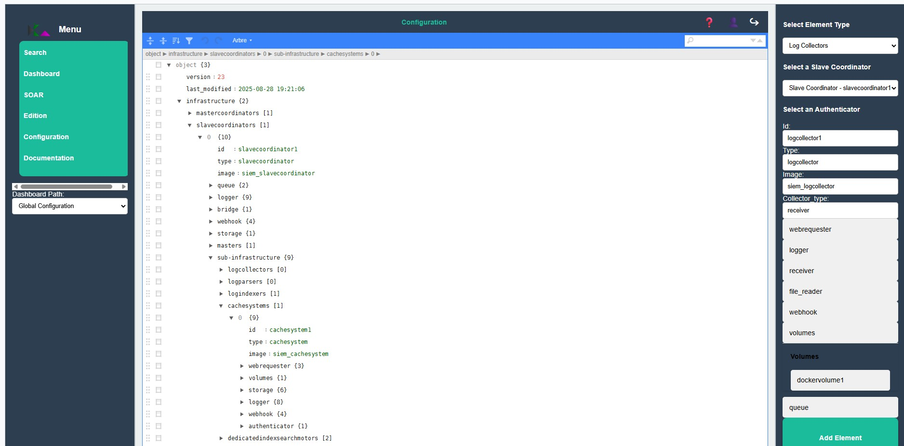

<!-- 
Copyright 2026 ttdantett DevBytesArt®

Licensed under the Apache License, Version 2.0 (the "License");
you may not use this file except in compliance with the License.
You may obtain a copy of the License at

    http://www.apache.org/licenses/LICENSE-2.0

Unless required by applicable law or agreed to in writing, software
distributed under the License is distributed on an "AS IS" BASIS,
WITHOUT WARRANTIES OR CONDITIONS OF ANY KIND, either express or implied.
See the License for the specific language governing permissions and
limitations under the License.

author: ttdantett
project: siem project
DOCUMENT: configuration doc
-->

# Configuration 

The web page is composed of :

- A select bar
- A json viewer
- Formular on the right
- Save button

The select bar is used to choose between :

- User interface preference
- Global configuration 
- Global privileges

The json viewer displays the configuration is json format and let the user change the configuration directly on JSON. 

The formular is used to help the user to change the configuration and specifically add new components or permissions in the configuration. 

The save button will save the new configuration by sending it the master coordinator or the authenticator. 

## User interface preferences 

TO BE COMPLETED

## Global configuration

Global configuration is provided only if :

- the user has the required permissions
- the user interface is connected to the master coordinator

Global configuration is the file that contains the infrastructure data in json format that compose the infrastructure of the application. It configures how the application is working:

- How the log are collected, parsed and indexed
- How the search is organised (division in dedicated index search to divide the research and increase efficiency)
- To which SOAR the user interface is connected
- To which location are SOAR installed in order to manage differents instance of SOAR
- and so on

When the configuration is validated, only the required part of the configuration will be sent to the components. Need to know basis. 

### Format of the configuration file

The global configuration is organised with the main sections:

- **version** : Version of the document in order to find any previous configuration
- **last_modified** : Date of the last modification of the file
- **infrastructure** : The infrastructure is the object that contains the components list
    - **master coordinators list** : The list of master coordinators and details of it
        - **master coordinators details**: the details of the components configuration
    - **slave coordinators list** : The list of slave coordinators and subinfrastructure
        - **slave coordinator details**: The component details of the slave coordinator
        - **subinfrastructure**: Each slave coordinator contains the list of components with details (all components except slave and master coordinators). 
            - **Components list**: Each kind of components (log collector, log parser, soar, ...) is listed in table as several same kind components can coexiste in the same slave coordinator management.
                - **Details of component**: The configuration itself of the component with all details (webhook, volume, id, name...)

### Format of the details configuration

- Common
    - **id**: Unique id to identify the component in the application.
    - **type**: The type of component (log collector, user interface, soar...).
    - **image**: The docker image to use to create the container.
    - **webrequester**: Configuration of the sender timeout, proxy and reverse proxy through the slave coordinator.
    - **volumes**: Path of the volume to store the data (physical, NFS, docker volume...)
    - **storage**: Path and configuration of the data storage (indexed data path, max size, saving frequency... ). This is mainly used by Log indexer
    - **logger**: The logger information where to store logs of the application. docker, file or print are selectionnable. Configuration of type of logging, max_file, max_size, level of logging...
    - **webhook**: Configuration of the network request receivers. IP, port, and certificates of the listener to received commands from others components. 
    - **queue**: Queue to store data (logs received for log collectors and log indexers...)
- Log indexer
    - **logservices**: Informations of the components to get and store data (user interface for dashboard, log parsers to collect and index logs...). User reference ids to get the information such as ip and port ...
    - **read_write**: Indicates if the index is read only or can be written. Logs collected from log parsers should be read only to preserve the integrity. Others indices used by soar or user interface for dashboard and reports must be read and write to save differents versions.
    - **lifecycle**: Frequency of the actions on logs (deletion, encryption, compression...)
    - **encryption**: Configuration of the encryption for indexed logs (delay : when greater than delay, encrypted, algorithm, path of the key ...)
    - **compression**: Choice of algorithm and delay for compression.
    - **deletion**: Choice of the delay for deletion.
- log collector
    - **receiver**: Host, port and protocol for the listener to collect logs.
    - **file_reader**: File path for log collection
    - **collector type**: Choice between each type of log collector (receiver, file_reader)
- log parser
    - **log collector**: Reference of the log collector to collector log for parsing purpose.
    - **plugins**: Folder of all plugins.
    - **parser**: Configuration of the parser type, name techno and type of parsers in the plugins folder.
    - **agregator**: Configuration of the agregator, Name of the agregator.
    - **prefilter**: Configuration of the regex and name of the prefilter. 
    - **posfilter**: Configuration of the post filter and name of the postfiler in the folder plugins.
    - **categorizer**: Configuration of the enrichment and categorization.
    - **anonymizer**: Configure the list of field to anonymize the type of anonymizer.
- User interface 
    - **reporting**: Configuration of index for the reporting saving. 
    - **indexsearch motor**: reference of the index search motor to launch queries.
    - **authenticator**: reference of the authenticator to check permissions.
- Index search motor
    - **max thread**: Max thread for researches.
    - **indexers**: List of dedicated index search motor to segregate the research and earn time.
- Dedicated Index search motor
    - **cache**: reference of the cache system to store logs in the network cache.
- Authenticator
    - **slavecoordinator**: Reference of the slave coordinator.
- SOAR
    - **commands**: Path of the user commands folder for python code.
    - **task**: Configuration of the index, tenant and techno to save the task in order to be able to schedule tasks. 
    - **integration**: Path of the vault to save password for instances of SOAR integration commands.
-  Slave coordinator
    - **master coordinator**: Reference of the master coordinator (only required for slave coordinator where user interface is able to change configuration path).
    - **bridge**: Configuration if bridge is enabled of not.

## Global privileges

Global privileges is provided only if:
- the user has the required permissions
- the user interface is connected to the master coordinator

Global privileges provide the way to manage the permissions of each users and groups to access to some services. The configuration is done in json format and let the administrator create :

- **resources**: This is the application, service or features that can be requested by the user. It contains id, name, type and description. 
- **roles**: This the role that set permissions on a resources. Inherit role is authorised. It contains id, name, type, inherit role and permissions (read or right associated to the id of the resources)
- **users**: This is where the user is associated with the roles. It contains the id, name, emails and array of roles of the user.

The global configuration is splitted in authenticators. Each authenticator has its own configuration file with its own resources, users and roles. It let the administrator habving the full control over the permissions.

### Format of the configuration

The format is simplest that the infrastructure configuration. 

- **version** : Version of the document in order to find any previous configuration
- **last_modified** : Date of the last modification of the file
- **infrastructure** : The infrastructure is the object that contains the components list
    - **authenticator**: Contains the id of the authenticators and lists:
        - **resources**: Resources lists and details
        - **roles**: Roles lists and details
        - **users**: Users lists and details