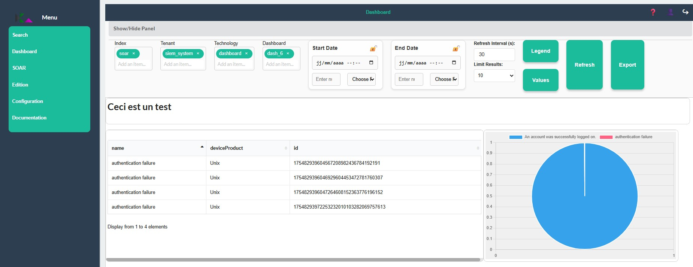

<!-- 
Copyright 2026 ttdantett DevBytesArt

Licensed under the Apache License, Version 2.0 (the "License");
you may not use this file except in compliance with the License.
You may obtain a copy of the License at

    http://www.apache.org/licenses/LICENSE-2.0

Unless required by applicable law or agreed to in writing, software
distributed under the License is distributed on an "AS IS" BASIS,
WITHOUT WARRANTIES OR CONDITIONS OF ANY KIND, either express or implied.
See the License for the specific language governing permissions and
limitations under the License.

author: ttdantett
project: siem project
DOCUMENT: dashboard doc
-->

# Dashboard 

Dashboard page is where the visualisation of any dashboard is possible. 

The web page contain the following elements:

- display/hide content
- index
- tenant
- technology
- dashboard 
- startdate 
- enddate
- refresh interval 
- limit results
- legend button
- values button
- refresh button
- export button
- dashboard central zone

## Load dashboard

In order to load the dashboard, it is required to know where it is stored:

- Index, Tenants, Technology (dashboard in general) and dashboard name.

Indices and Tenants are proposed according to the permissions of the user. 

All data are stored on only one index. Indices are physically or logically segregated each others. This is the main segregation of data. 

It could be several tenants in the index. Tenants are logically segregated. 

Refresh Interval is updated directly when the change is done. Be careful of the time required to make researches and increase the period if data are not displayed as the researches can be not finished. 

Legend and values are used to display data or legend on graphs displayed in the report.

Refresh is used to load manually the dashboard but the refresh interval do it automatically. This button can be used to refresh before the end of the count down. 

The central zone will display the dashboard loaded. 