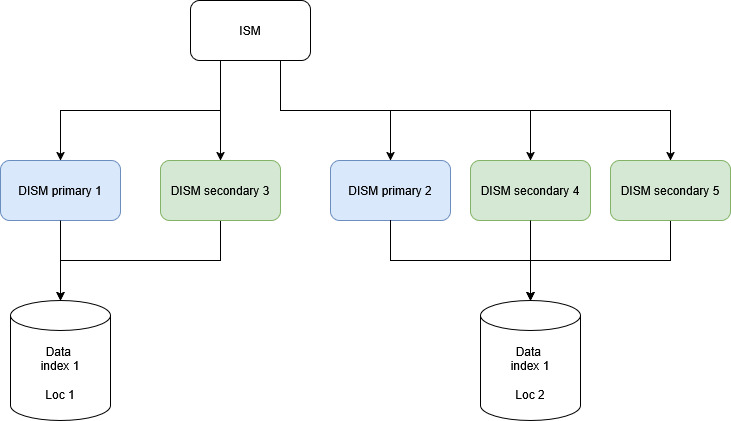

<!-- 
Copyright 2026 ttdantett DevBytesArt

Licensed under the Apache License, Version 2.0 (the "License");
you may not use this file except in compliance with the License.
You may obtain a copy of the License at

    http://www.apache.org/licenses/LICENSE-2.0

Unless required by applicable law or agreed to in writing, software
distributed under the License is distributed on an "AS IS" BASIS,
WITHOUT WARRANTIES OR CONDITIONS OF ANY KIND, either express or implied.
See the License for the specific language governing permissions and
limitations under the License.

author: ttdantett
project: siem project
DOCUMENT: dedicated index search motor doc
-->

# Dedicated Index Search Motor

Dedicated Index Search Motor (DISM) is used to search on a specific index only. 
This limitation has been made to avoid data leaks and increase efficiency of the researches. 

Dedicated index search will search ids on the index files and return detailed data.

This component is able to find data parsed and raw and return to the index search motor that requests the research the data corresponding.

## Research function

When the Index Search Motor requests data, it can requests to several Dedicated Index Search Motor. Each DISM is able to search to only one location the data and only one index. 

The configuration path is used to specify the path of the folder that contains data. As an index can be split in several disk spaces and folder, it is required to have several DISM to get all data from the index if the index is split.

The interest of this infrastructure is to divise the workload of the DISM to find only limited data.

## Research strategy

Two strategies can be used to research data:

- by dates
- equitables (divide ids equivalently)

 By default, the Index Search Motor will split the researches by dates and index and send all queries corresponding to the dates and index to the DISM that perform only one part of the researches.

The Index Search Motor will concatenate all data sent by the DISM.

The DISM perform only basic researches such as basic and advanced conditions (key:value AND/OR/NOT ... ). The others functions are used by the Index Search Motor before sending basics query to the DISM.

DISM use a parallelism system to split the data researches and earn time on the results display.

## Primary / Secondary DISM

DISM can be primary or secondary. 
Primary DISM is limited by one by storage space. If the index is separated in several disk spaces, all location must be covered by a DISM. Primary is used to search on all these location to have all data of the index. **If one location is forgotten, data will be incomplete**. 

Secondary DISM are used to support primaries DISM in the researches. Several DISM can be used to help the DISM to perform researches and the same location and the query is divided by date or by ids to all available DISM primaries and secondaries to have data. 

Primaries DISM are **mandatory** and secondaries DISM are **optional**.

## Index search, then data search

First the DISM verify ids were basic/advanced conditions are corresponding and return only ids. 

Then ids are used to retrieve data in the storage file.

## Storage in cache

If cache storage is configured in the configuration file, the cache system is used before using search data in the files. The ids list is sent to the cache system which is in network that return data and list of ids found. The DISM make gap between found and unfound and search in documents all data unfound. 

This mecanism will increase the efficiency of the researches on data of big size as data is stored in the memory on cache system. 

However, as the cache system is on the network, this cache can be a bottleneck or slows the entire researches. It is to be used and tested depending on the case. 

**Avoid using cache system in index read and write because the cache will save only the first value and if the log is modified as it is the case for the SOAR playbook/context, dashboard and report templates, the siem will display the first value and not the last modifications.**