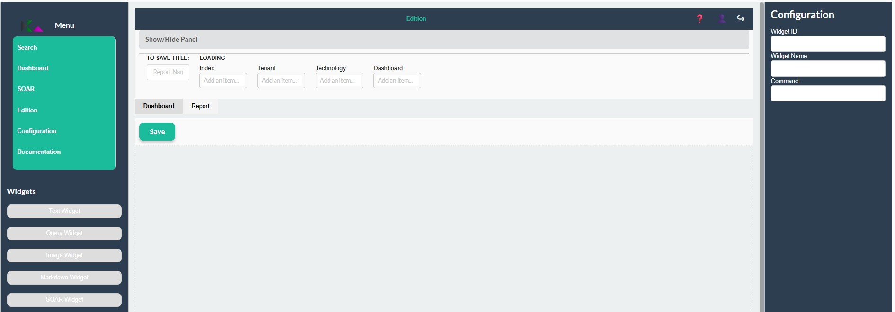
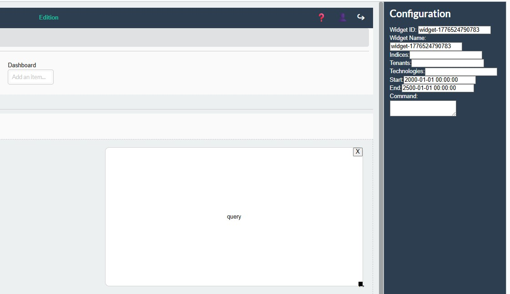

<!-- 
Copyright 2026 ttdantett DevBytesArt

Licensed under the Apache License, Version 2.0 (the "License");
you may not use this file except in compliance with the License.
You may obtain a copy of the License at

    http://www.apache.org/licenses/LICENSE-2.0

Unless required by applicable law or agreed to in writing, software
distributed under the License is distributed on an "AS IS" BASIS,
WITHOUT WARRANTIES OR CONDITIONS OF ANY KIND, either express or implied.
See the License for the specific language governing permissions and
limitations under the License.

author: ttdantett
project: siem project
DOCUMENT: edition doc
-->

# Dashboard/Report Edition

Dashboard/Report edition is the page used to create or modify dashboards/reports. 

The webpage contains the followings elements:

- Save title input
- index 
- tenant
- dashboard
- Dashboard and report tab
- Save button
- Widgets list on the left menu
- Configuration menu on the right panel

The dashboard will only be displayed in real time (but it can be exported) from the dashboard page, but the report are downloadable from the SOAR. 

## Components of the page

On the panel at the top of the page, the user can create a new dashboard or loading a new dashboard.

To create a new dashboard, let the dashboard input on the right empty. 
To load or modify a dashboard, complete this input on the right. 

The title of the dashboard is the input on the top left and let create a new version of an existing dashboard/report.

Indices and Tenants are proposed according to the permissions of the user. 

All data are stored on only one index. Indices are physically or logically segregated each others. This is the main segregation of data. 

It could be several tenants in the index. Tenants are logically segregated. 

In order to find dashboards/reports available, select first the index and tenants. The dashboard list will be loaded with available dashboards/reports name based on the previous selection. 

**Keep in mind that in order to save a dashboard, a log indexer with the right index must be configured to get the dashboard from the queue and index it**

Indeed, when saving the dashboard will be stored in a queue and the log indexer will collect dahsboards and store it in the index. Depending on the configuration, the saving can takes times or not be implemented. In case of problem check with the administrator the configuration of the application. 

Depending on which tab is selected (dashboard or report), the type saved will be changed.

The list of widgets on the left menu are draggable on the drop zone at the center of the screen. 

On the right the configuration menu is used when a widget is selected and form is dependant of the type of widget.

## Widgets

Differents kind of widgets are available on the left menu:

- **Text** : Any text paragraph to display in the dashboard/report
- **Query** :  The query for the search (see [Search documentation](./search_doc))
- **Image** : Image downloadable from url
- **Markdown** : Markdown basic to add style, list box, title... 
- **SOAR** : SOAR widget to launch commands. This widget let the dahsboard display alerts and modify contents of the alerts for example. 

***Widgets and dashboards are not fully implemented correctly and will be improved***

In order to create the dashboard, drag and drop the widget from the left menu to the central drop zone. 

Configuration contains always an id of a widget and a name and content or query. 

Others fields may be required to configure the widgets such as:

- Indices
- Tenants 
- Technologies
- Dates
- Query or Commands