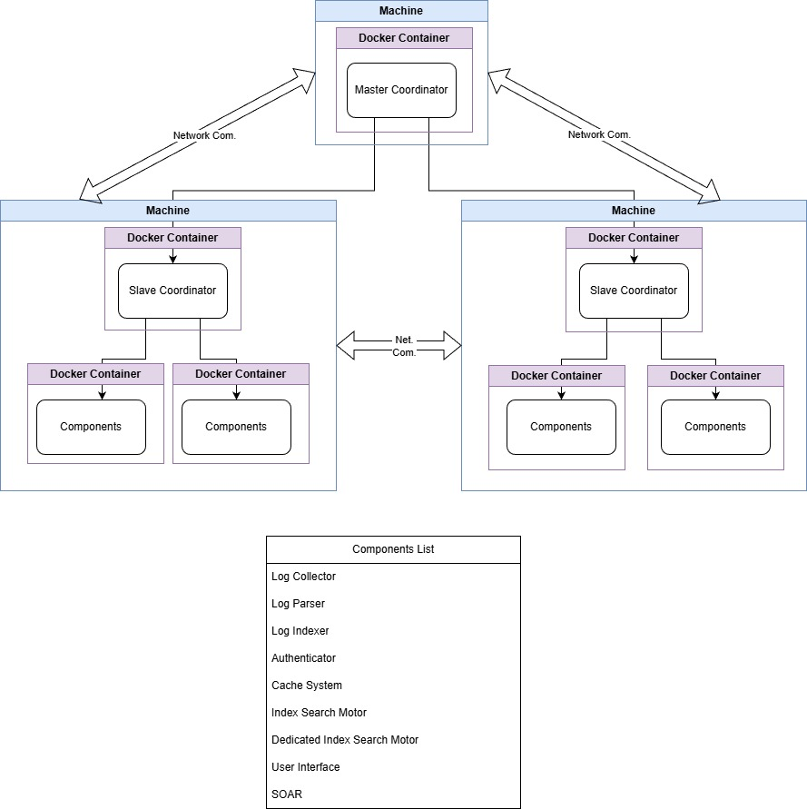
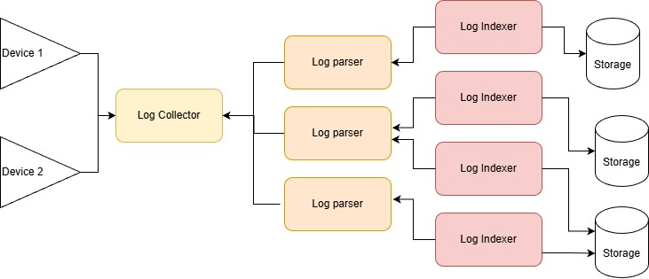
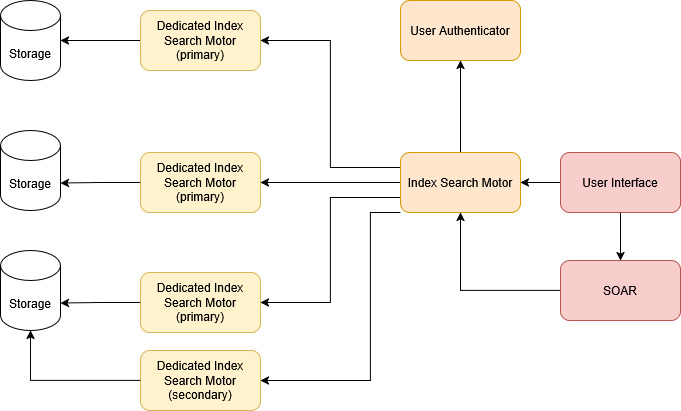

<!-- 
Copyright 2026 ttdantett DevBytesArt®

Licensed under the Apache License, Version 2.0 (the "License");
you may not use this file except in compliance with the License.
You may obtain a copy of the License at

    http://www.apache.org/licenses/LICENSE-2.0

Unless required by applicable law or agreed to in writing, software
distributed under the License is distributed on an "AS IS" BASIS,
WITHOUT WARRANTIES OR CONDITIONS OF ANY KIND, either express or implied.
See the License for the specific language governing permissions and
limitations under the License.

author: ttdantett
project: siem project
DOCUMENT: index doc
-->

# Welcome to the Documentation

This documentation provides a complete overview of **the SIEM**, which combines both a **SIEM** and a **SOAR** system.  
The solution is designed to run using **Docker containers**, allowing modularity, scalability, and easy deployment across multiple machines.

## Specificities of this project
### Provides SIEM and SOAR 

While other SIEM and SOAR are in general two differents project, in this one, the SOAR and the SIEM are paired by default and the SOAR is depending of the SIEM to store data. It means that any data of the SOAR can be retrievable in another instance from anywhere if the SOAR has accesses and rights to perform requests on the SIEM.

### Sourcemainly in python, html and javascript

The source code is mainly in python, html and javascript that let the administrator read and modify the source code for any specific requirement. Other langage can be added in the future to increase the efficiency of the programs.

### Containerization

This project ios based on docker or podman container that let the administrator decide about the infrastructure and how, how many and where are the differents components. This containerization is also dynamic and let the user choose and change at any time a configuration for each components of the SIEM and SOAR.

### Project divided into components

This project is divided into components with a dedicated container for each that provide services. All services works in collaboration with each others and use the network to communicate. That let the infrastructure to be splitted in several differents network and location.

### Configuration 

This project works with master and slave. The configuration file is shared from the master to the slaves and only need to know data are shared to the slaves. The configuration is done via a json file and the user interface provides a formular more user friendly to create elements. 

### MSSP project

This platform can be used as MSSP (Managed Security Service Provider) for company that provide SOC for several customer. As the infrastructure is totally customisable and indices and tenants segregate the data, access and permissions let the administrator configure who can use and see what.

### Indices and Tenant segregation

Indices are splitted using the component Dedicated Index Search Motor and Log Indexer and data can be stored on a specific, folder disk or even remote disk. Several Tenants can be put in index folder and are placed on differents folders. 

Confidentiality is ensured by this system. That is why, it is advised to use a differents disk for each index. In this case, indices are segregated physically and tenants logically. 

### Multiple components with differents function and permissions

This project is designed to let components works with each others with differents rights and permissions.
For example a user interface can be provided to a customer with permissions to see indices of his data. And other user interface can be available to the same index search motor for administrator to see data from the several customers.

Some components can work in the same time to increase efficiency. Dedicated Index Search that search data on indices can work together to reduce the load of eachs others and provide results quickly.

Several Log Parsers can collect from the same Log Collector to reduce the load of the log parser and reduce the data in memory for the Log Collector.

### Log Collection, parsing and Indexing

Contrary to several SIEM that collect and send logs to parser, here the log parser request the log collector to have logs and the log indexer requests logs from the parser to index logs. It let several log parser to collect logs from the log collector when it is ready and avoid overload of log parsing or indexing.

### Indexing and data storage is done in JSON

Indexing is done in JSON, can be compressed and encrypted in order for the administrator to read data manually in case of need or encrypt it where the data is sensible. 

### Index segregation in part

Index segregation on different container and disk and management by several component enable the user to manage each part of the same index differently. Each component can manage a part of an index that can be requested from the Index Search Motor to give results of the overall index.

### SOAR customisable

In the SOAR it is possible to create playbook, context and commands. Commands uses python code injected dynamically by the user and by default. The SOAR with a command is able to reload functions to add features. 

### SOAR instances

Each SOAR instance are independant from each others that let the user create dev, uat and prod instances of SOAR or even create several SOAR instance to perform different operations.

Instance is a container with SOAR deamon that works. Some others SOAR in the market use a container for each playbook or command launched. A lot of containers can be used in the same time on the machine. With this solution, the number of container is more customisable.

## How the Platform Works

The architecture is based on a **master/slave model**:

- **The Master**  
  Central component responsible for holding the global configuration. It does not run the SIEM/SOAR services itself, but:
  - Manages and distributes only the relevant configuration blocks to each node.
  - Ensures consistent synchronization of components.

- **The Slaves**  
  Each slave receives its own configuration from the master and automatically creates the necessary containers to run the components.

This approach allows installations :
- to scale easily
- enabling large or distributed deployments
- deploy differents type of infrastructure (SIEM, SOAR, both, Log collection and parsing...)
- MSSP (Manage Security Service Provier) usage
- keeping configuration centralized and maintainable. 

## Platform Components

Find below the element that composes the infrastructure of the SIEM/SOAR.

| Component | Link |
|---|---|
| logcollector | [View Details](./logcollector) |
| logparser | [View Details](./logparser) |
| logindexer | [View Details](./logindexer) |
| slavecoordinator | [View Details](./slavecoordinator) |
| mastercoordinator | [View Details](./mastercoordinator) |
| authenticator | [View Details](./authenticator) |
| userinterface | [View Details](./userinterface) |
| soar | [View Details](./soar) |
| indexsearchmotor | [View Details](./indexsearchmotor) |
| dedicatedindexsearchmotor | [View Details](./dedicatedindexsearchmotor) |
| cachesystem | [View Details](./cachesystem) |

## Index, Tenant and Technology and dates

The concept of index, tenant and technology is probably the most important concept to understand for the user to use correctly the SIEM system.

The index is a logical or physical segregation. Indeed, Index are stored by a logindexer dedicated to the index and store it in a folder that can be in a specific and separate disk than the others. It can be logically segregated as several logindexer can store the data in the same disk space but not in the same folder. Indices are and must be always stored on differents folders and/or disks. In order to search in a index, it must have a dedicated index search motor that will search on only one index.

However, as, it can have several logindexers that store data of the same index in several folder, to search in all the index, a dedicated index search must be available for the index search motor. 

**A research must get data from all folder that contain the index data and regroup it (see Log collection, parsing and indexing chain and section search concept to have more details)**

Tenant is a logical segregation inside an index. A tenant is dedicated to an index, that is why it is possible to have same tenants name in differents indices, but only one in the same index. 

ex: *Index: datacenter1, tenant:customer1 and index: datacenter2, tenant: customer1" are not the same.*

Indices and tenants are used to segregate data and to improve efficiency with limiting the scope of a research.

The index is composed of a tenant, dates and technology in this order. 
When the search is done, the search query is provided to all dedicated index search by the index search motor (if index does not correspond the configuration of the dedicated index search motor, it is ignored), the DISM will look in the index folder the index file. The index files provide a json file with tenant key. Inside the tenant key, there is date keys, then technology keys and finally fields keys. 

That is why to improve the research, it is required to know the index and the tenant, and advised to know the dates and the technologies. 

**Conclusion: You always need to know where your data are (which index and which tenant)**

## Log collection, parsing and indexing chain

The primary function of a SIEM is to collect logs, normalize them, and index them so they can be efficiently searched and analyzed later in the process.

In this architecture, the log collection chain is managed by the log collector, which listens to data sources or reads files to retrieve logs and temporarily stores them until the log parser is ready to process them.

The log parser then requests the logs stored in the log collector’s queue. Multiple log parsers can pull data from the same log collector. Instead of having the logs pushed directly to the SIEM, the parsers fetch them on demand. This prevents overload on the parsers and ensures they have enough time to process each log entry properly. Since several log parsers can operate simultaneously, the parsing workload is distributed more evenly, and the log collector is emptied progressively as it delivers logs.

The log indexer works in a similar way, but instead of collecting logs from the log collector, it retrieves them from the log parser.

The log indexer can store on data on one storage folder, however, several log indexer can store data in the same folder. The log indexer will index data in the index file adding new values in the folder. This solution must be used only when not a lot of data are stored as it slow the indexing. 

## Search concept

In order to research data in the index, the user interface or the SOAR requests the Index Search Motor which is the heart of the search component.

The Index Search Motor will interprets the requests, separate the differents operations of the request (splitted by | ). Launch first request on data by separated requests on differents Dedicated Index Motor Search in order to accelerate the researches.

The Dedicated Index Search will search on index first in order to find the Ids of the logs that respect the conditions of the Search operations and then get the details of the logs that correspond of the results from the database.

It send the results to the Index Search Motor that stores all results from Dedicated Index Search Motor into variables in order to group results and perform other operations that requires the detailed logs. 

The Index Search Motor stores the results in variables and send only (except if required by the user) 10 lines of results for a table and the graph results to the User Interface. 

Index Search Motor must send request to all primary Dedicated Index Search Motor to have the complete results or miss information. The Secondary Dedicated Index Search Motor are used to split the load of research and accelerate the research.

## How This Documentation Is Structured

The documentation is organized into:

1. **Concepts** – Global platform architecture, how components communicate, deployment principles  
2. **Components** – One page per element, including configuration and purpose  
3. **Operations & Installation** – How to deploy, monitor, update, and scale  
4. **Best Practices** – Recommended setups, security rules, and operational guidance

<!--
## Recommendation for Documenting This Product

To make this documentation clear and maintainable, consider:

✔ **Use diagrams or sequence charts**  
Showing how master and slaves communicate, how containers start, etc.

✔ **Provide real-world examples**  
Installation steps, configuration snippets, command sequences.

✔ **Explain logs and troubleshooting paths**  
A SIEM/SOAR is most useful when failures are easy to track.

✔ **Document expected behavior per component**  
For example:
- What happens when configuration changes  
- How components react to downtime  
- Startup order and dependencies

✔ **Add a glossary**  
Security tools have a lot of domain-specific terminology—clarifying these will help new users onboard more easily.

---
-->

Welcome, and enjoy exploring the platform! 
