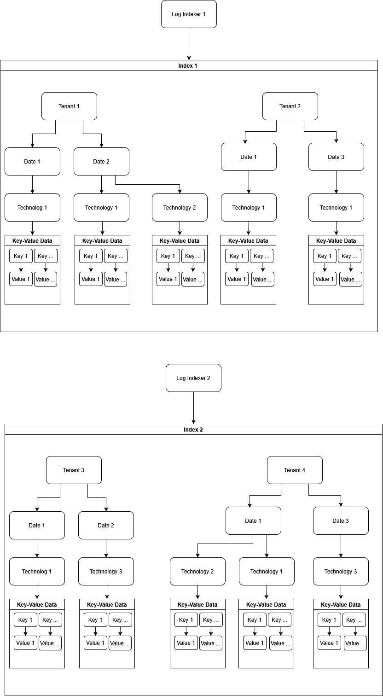

<!-- 
Copyright 2026 ttdantett DevBytesArt®

Licensed under the Apache License, Version 2.0 (the "License");
you may not use this file except in compliance with the License.
You may obtain a copy of the License at

    http://www.apache.org/licenses/LICENSE-2.0

Unless required by applicable law or agreed to in writing, software
distributed under the License is distributed on an "AS IS" BASIS,
WITHOUT WARRANTIES OR CONDITIONS OF ANY KIND, either express or implied.
See the License for the specific language governing permissions and
limitations under the License.

author: ttdantett
project: siem project
DOCUMENT: logindexer doc
-->

# Log Indexer

In order to perform researches in the logs, it is required first to index the data in a centralized place. However, a SIEM must be able to research on a lot of data and a centralisation on a specific place will take a lot of storage in the disk. Adding that some data must be segregated from the other, this solution can use several place to store the logs and be able to research on all places to search data. 

## Log collection

Similarly to the rest of the application, it is the log indexer that will collect log from the log parser and for the same reason such as decrease the load the of log indexer, split and parallelise tasks... 

The configuration file defines the address, port, protocol and certificates to collect the parsed and unparsed logs. 

The log parser will forward the log in a json format that contain the id of the log, the parsed log and the unparsed one in the same key value.

## Data enrichment

In order to index correctly data

## Indexing

**The log indexer authorizes only one index** in order to split logically or even physically the data stored and avoid potential data leak in on index or another. 

The log indexer seperates also logically several tenant inside the index that let the user split and/or accelereate the researches in the index. 

Technologies and dates are also keys used to accelerate researches.

Indexing uses the following keys to split the data efficiently. 

- Index
- Tenant
- Date
- Technologies
- key
- values

Indices are split in tenants, tenants are split in dates (day or day and hours depending on the configuration), dates are split in technologies, technologies are split in keys and keys contains all the id of logs the values that contains the keys. 

### Main indexing file

According to the configuration file and path of the index, the index file is located in the folder that contains the name of the index and depending on the primary or secondary (backup), on the according folder.

The folder contains the history of the file with modification date and hash. 

As the index can be huge, index is composed of several files. 

The folder contains also the summary file that summarize the tenant, dates, technologies and files that contains data. It is used to accelerate researches in huge index without having to read every files.

The main index pages are json file located in the folder "indices" that contains the data based on the keys tenants, dates, technologies and keys and contains ids of the logs only. 

These ids are used to search later the log parsed or unparsed directly in the storage. 

File are divided and numbered according to the max size of the file defined in the configuration file. 

## Storage

The SIEM stores parsed and unparsed event in order to be able to researches on both of them. 

Parsed and unparsed events are located on differents folders named with the name of tenants and split by folders that contains dates. 

Folders contains both parsed and unparsed with an incremental numbers used when the max size of file is reached. Max size is defined in the configuration file.

According to the configuration file, the data in folder parsed and unparsed can be compressed or encrypted (**not implemented yet**)

### Storage log parsed

In the parsed files, a json file contains the list of ids as keys and all the parsed data contained in the logs.

### Storage log unparsed

In the unparsd files, a json file contains the list of ids as keys and the raw event in base64. 

## Research

The research is done by the [Index Search Motor](./indexsearchmotor) and [Dedicated Index Search Motor](./dedicatedindexsearchmotor).

## Backup

The log index can be configured as primary or secondary. The primary log indexer will get the logs from a log parser and index it. 

Instead of the primary, the secondary log indexer will collect data from a primary or another secondary log indexer to copy files and store it on the secondary folder. 

It is used for backup file and can be used to divide and accelerate researches. 

The log indexer will compare the history file with hash and for all files that have hashes differents, it will download it in its folder. 

Log indexer can be everywhere in the infrastructure (on customer side or another provider side, or even on the same machine.s)