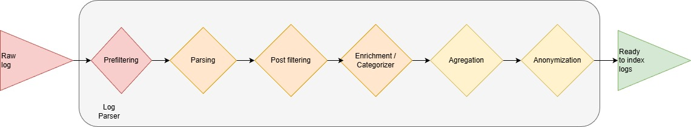

<!-- 
Copyright 2026 ttdantett DevBytesArt

Licensed under the Apache License, Version 2.0 (the "License");
you may not use this file except in compliance with the License.
You may obtain a copy of the License at

    http://www.apache.org/licenses/LICENSE-2.0

Unless required by applicable law or agreed to in writing, software
distributed under the License is distributed on an "AS IS" BASIS,
WITHOUT WARRANTIES OR CONDITIONS OF ANY KIND, either express or implied.
See the License for the specific language governing permissions and
limitations under the License.

author: ttdantett
project: siem project
DOCUMENT: logparser doc
-->

# Log Parser

The log parser will collect logs from the log collector and perform the following operations:

- prefiltering
- parsing
- postfiltering
- enrichment
- agregation
- anonymization

When configured actions are executed in this order, the log are stored in queue waiting the requests from log indexers.

This code is based on the plugins architecture and let administrator to create their own type of operations. This method was mainly used for the parsing to let administrators create their own parsing and enrichment.

## Prefiltering

The prefiltering purpose is to filter the log before any process is executed. 

Some logs are not useless for detection purpose and event worse, it costs processing and storage. 

A regex is configured and when the log is exfiltered when the regex matches.

## Parsing

Parsing purpose is to transform the log from the entry format in json interpretable by the SIEM. 

In the configuration file, parsers can be choose if the only one technology is available or multiple parser are possible. In this case, parsers will be selected one after the other to detect the format of log. However, the technology completed will be **Multiple** and the storage in the log indexer will be in this technology. 

The parsing is a python script that heritates from the LPPlugins. 

## Postfiltering

The postfiltering is done on the json log formatted after the parsing. 

It is possible to filter in or out value depending on what is required in term of logs and create custom code to postfilter and add in the list of plugins.

In the configuration file, a json with key and value is waited to filter in or out.

## Enrichment

The enrichment or categorisation is used to add fields and value in the log, before the indexing. 

Enrichment can be extremely useful to identify depending on some values critical information for the query such as:

- Network information of customer (zone and name depending on IP or hostname)
- Categorisation of action (authentication, session opening, ...)
- Verdict for IOC
- Simplification or grouping of values
- comments depending on values
- and so on

As for the other type of operation, this is totally customisable with the plugin architecture for the enrichment.

## Agregation

This operation is not implemented yet.

Agregation is used to agregate similar logs based on fields and timing in order to reduce the number of logs indexed in the SIEM. For several similar logs, only one will be send adding the number of recurrence of these logs. But, the raw logs are keept with the same id to find all the logs. 

Agregation uses queue to store logs and keep it in the period. This method can be hard consumer of resources of computer.

## Anonymization

Anonymization is used to hide data from some users, however, **Values are visible in raw logs**. Be careful with the permissions of users before give accesses to raw logs if anonymization is in place. 

As it is working with plugins architecture, it is possible for the user to add his own anonymization type such as :

- complete anonymization
- pseudo anonymization
- hash
- and so on

