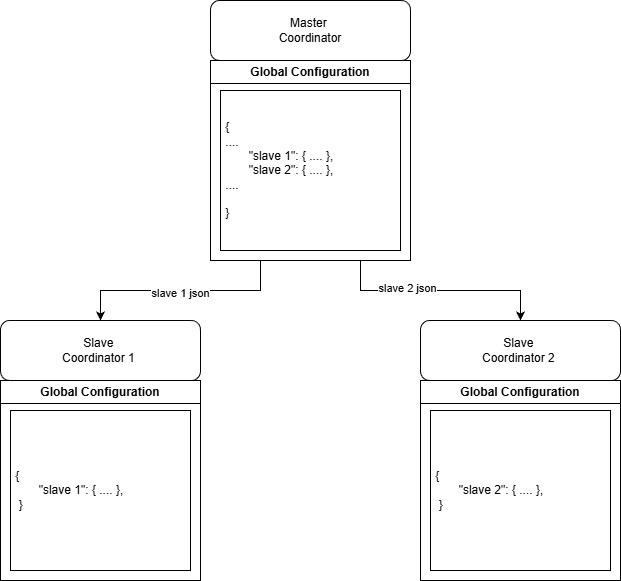

<!-- 
Copyright 2026 ttdantett DevBytesArt®

Licensed under the Apache License, Version 2.0 (the "License");
you may not use this file except in compliance with the License.
You may obtain a copy of the License at

    http://www.apache.org/licenses/LICENSE-2.0

Unless required by applicable law or agreed to in writing, software
distributed under the License is distributed on an "AS IS" BASIS,
WITHOUT WARRANTIES OR CONDITIONS OF ANY KIND, either express or implied.
See the License for the specific language governing permissions and
limitations under the License.

author: ttdantett
project: siem project
DOCUMENT: master coordinator doc
-->

# Master Coordinator

## Purpose of the Master Coordinator

The master coordinator, with slave coordinator are the main part of the application as the coordinators will build the global of local infrastructure and monitor the machine itself.

The master coordinator will keep and diffuse the main configuration and privileges to the slave coordinator. 

## Configuration 

The application is configured using a structured JSON file. This file can be created and edited manually, or automatically through the integrated user interface. The interface assists authorized users in building and modifying components more easily, reducing the risk of configuration errors.

All configuration data is maintained centrally on the master node, which stores the full configuration of the entire infrastructure. Each slave coordinator only receives and uses the specific configuration subset that applies to its own role. This ensures a consistent global configuration while minimizing the data exchanged and limiting each node’s knowledge to what is strictly required.

### Infrastructure Configuration

The configuration of the infrastructure is used to :

- configure the master coordinator itself
- configure each slave coordinators 
- configure all components on each infrastructure

On the web page, it is possible to use the formular on the right menu to create new elements or modify the json file itself and forward the configuration file.

Some configuration are not displayed on the json file, in this case, it is possible to find all possible configuration with the formular.

### Privileges configuration

The configuration of privileges is used to create:

- users privileges
- resources
- roles

The configuration of the user associated the user to roles.

The resources is used to identified a resource in the infrastructure and let the user to configure a specific permission for this resource in a role.

The role associates a resources to another role or a specific permission to a resources. 

Similarly to the infrastructure configuration, it is possible to create these roles, users and resources with the formular on the right menu or modify the json file directly.

This configuration file is send to authenticator, not slave coordinator.

### User preferences configuration

This part is not implemented right now.

## Monitoring

This part is not implemented yet.

<!-- The master coordinator monitors the infrastructure and decides to modify itself and automatically the infrastructure to improve efficiency of the infrastructure or activate redundancy in case of disaster for example -->

## Redundancy

This part is not implemented yet.

<!--  
The master coordinator with a secondary master coordinator to elect a master and keep the coordination when the infrastructure is in trouble.
 -->