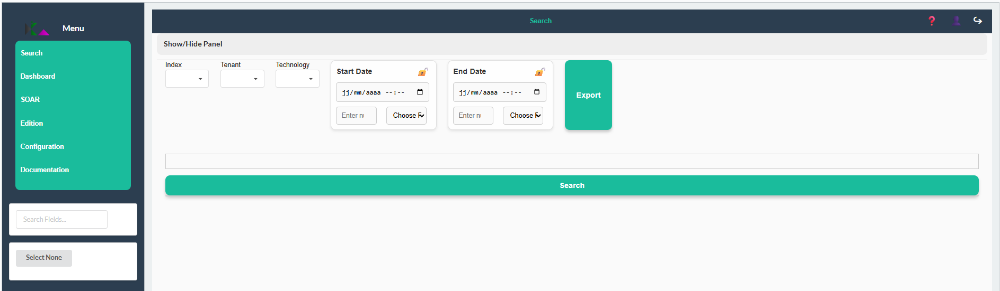
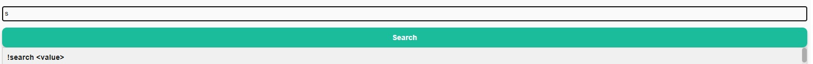
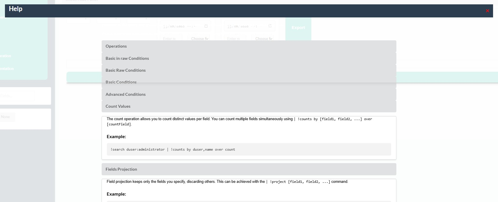

<!-- 
Copyright 2026 ttdantett DevBytesArt®

Licensed under the Apache License, Version 2.0 (the "License");
you may not use this file except in compliance with the License.
You may obtain a copy of the License at

    http://www.apache.org/licenses/LICENSE-2.0

Unless required by applicable law or agreed to in writing, software
distributed under the License is distributed on an "AS IS" BASIS,
WITHOUT WARRANTIES OR CONDITIONS OF ANY KIND, either express or implied.
See the License for the specific language governing permissions and
limitations under the License.

author: ttdantett
project: siem project
DOCUMENT: search doc
-->

# Search page



The search page is composed of search tags for :
- mask search bar
- index 
- tenants
- technology
- start date
- end date
- export button
- search bar
- search launch button
- field selector

## Components of the page

It is possible to hide/display the search bar with the button "Show/Hide Panel".

In order to make researches, the first step is to locate data in the application. 
User when connected has permissions to access to some indices and tenants. 

All data are stored on only one index. Indices are physically or logically segregated each others. This is the main segregation of data. 

It could be several tenants in the index. Tenants are logically segregated. 

Technology is a way to split data and improve efficiency of researches by filter data more efficiently as by this filter is applied before in the researches than others search filter in the index search. 

Start date and end date is used to limit the scope of the research and increase efficiency of the research. 
Date can be relative or absolute. If the lock is active, the date will get the minimum and maximum date. 

When the search is launch, if the result is a table type, column are listed on the left menu. It is possible to select only some fields by chosing, select or deselect the field in the list.

The export button can be used to export in different format the result of the research.

Mutiselection is possible for indices, tenants and technology but not for dates. This allow make the researchs on several data location. 

## Help in search

In order to help the user to compose a research and understand the parameters and how works the operations behind the research, suggestions and help sections on the application.

- suggestions

Suggestions are provided when the user tip the first letter of the search and provides the list of the operations available and parameters to use.



- help page for search key words

The section helps gives the details of all operations in order to understand how to use each operations. The menu is available by clicking on the "?" on the top menu.



## Structure of the research

The research must respect a structure to work correctly. 

The separator to split the operations is "|".

Variable are working a generic search and must respect this same structure but using ";" to replace "|".

In a generic search, the first command should be the filter of the data:
ex: 
```
!search <filter>
```
The result of this operation is a table with all fields.

Then, another operations can be used for example, limit the fields display with !project or !transform to create others fields with action on existing fields.

```
!search <filter> |  !project <field1,field2>
```
The result is still a table with limited fields

Then the agregation can done to display count of certains fields. The agregation can be done with multiple fields. 

```
!search <filter> |  !project <field1,field2> | !counts by <field1,field2> over count
```
The count field is now created. 
A table with lines will be displayed:

- field1_1,field2_1,count
- field1_1,field2_2,count
- field1_2,field2_1,count
- .... 

In order to display other type of results than table such as chart, use the function render.

```
!search <filter> |  !project <field1,field2> | !counts by <field1,field2> over count | !render <type chart> by field1 over count
```

The result will be display in chart (pie chart, bar chart, line chart, ...)

Consults the documentation directly on the application to have more details in the operation.
