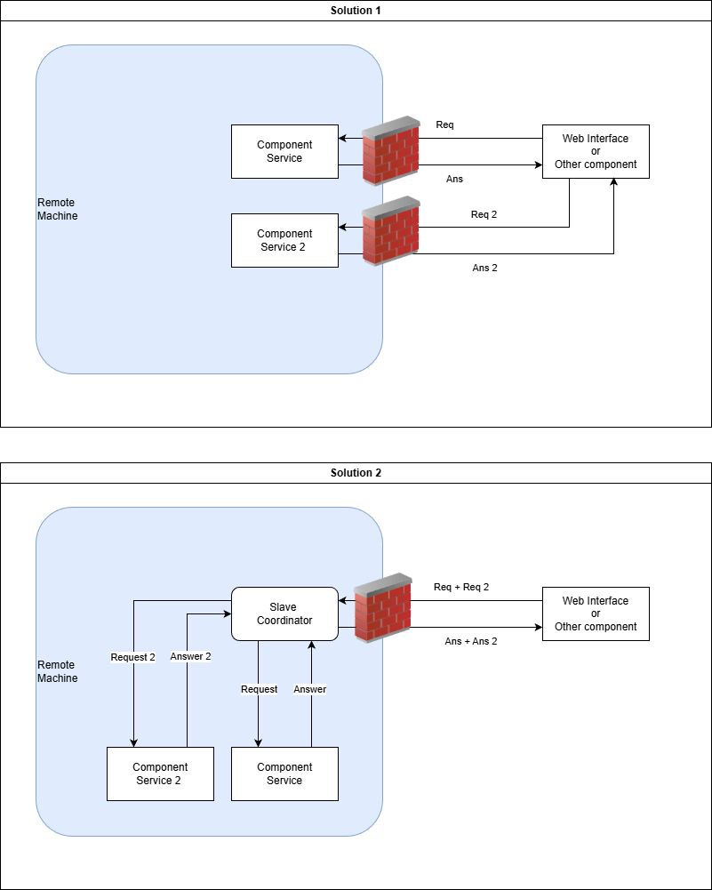

<!-- 
Copyright 2026 ttdantett DevBytesArt

Licensed under the Apache License, Version 2.0 (the "License");
you may not use this file except in compliance with the License.
You may obtain a copy of the License at

    http://www.apache.org/licenses/LICENSE-2.0

Unless required by applicable law or agreed to in writing, software
distributed under the License is distributed on an "AS IS" BASIS,
WITHOUT WARRANTIES OR CONDITIONS OF ANY KIND, either express or implied.
See the License for the specific language governing permissions and
limitations under the License.

author: ttdantett
project: siem project
DOCUMENT: slace coordinator doc
-->

# Slave Coordinator

The slave coordinator, with the master coordinator is the only component to create manually by the user as the slave coordinator must exist to receive the configuration file and create components of the infrastructure.

Slave coordinator is listening for master coordinator configuration file to identify new, modified or deleted component and modify the infrastructure on the machine itself.

Even it is possible to use multiple slave coordinator in the same machine, it is advised to limit to one slave coordinator per machine.

## Component creation

### Interpretation configuration

The configuration file received by the slave coordinator is interpreted to determine any :

- new container in the configuration file
- modify configuration on existing container
- machine present in the old file but not in the new one

### self configuration modification

Similarly to all component of the infrastructure, the slave coordinator is able to modify is own configuration. However, some changes are not possible on the slave coordinator without restart manually the container.

The host, ip and port must be configured and restart manually. 

### Creation component

If a machine is not present in the old configuration and present in the new one, the slave coordinator will interpret the configuration to find the right container associated to the type of the component and create the container. 

When the container is created, the slave coordinator will forward the configuration file associated to the component to the container. The component will interpret the configuration file and change its configuration.

### Modification component

If a configuration is modified, the slave coordinator will see if the container must be restarted or not. For example in case of change in the port listening or ip address... 

If no restart is required, the configuration file is sent directly to the component that will change its configuration.

### Delete component

If a machine that were present in the old version of the configuration file and not present in the new one, then the container will be erased from the docker manager.

## Component monitoring

If present in the configuration file, the slave coordinator can get container data to monitor the infrastructure in the machine and the machine itself.

These data can be used by the user or the master coordinator to modify the infrastructure and improve efficiency of the application.

## Proxy command

The slave coordinator can be used to forward commands to the components in order to not expose ports directly to the network. 

This feature is available in the configuration file.

However, in this case, the slave coordinator will received request and data in response to forward it to sender. Thus, the slave coordinator will take all the load of the components present in the infrastructure. This proxy can be the bottleneck for all components of the machine.

Find below an illustration of the two solutions:

- Solution 1: Classic infrastructure
- Solution 2: Slave Coordinator as proxy command

