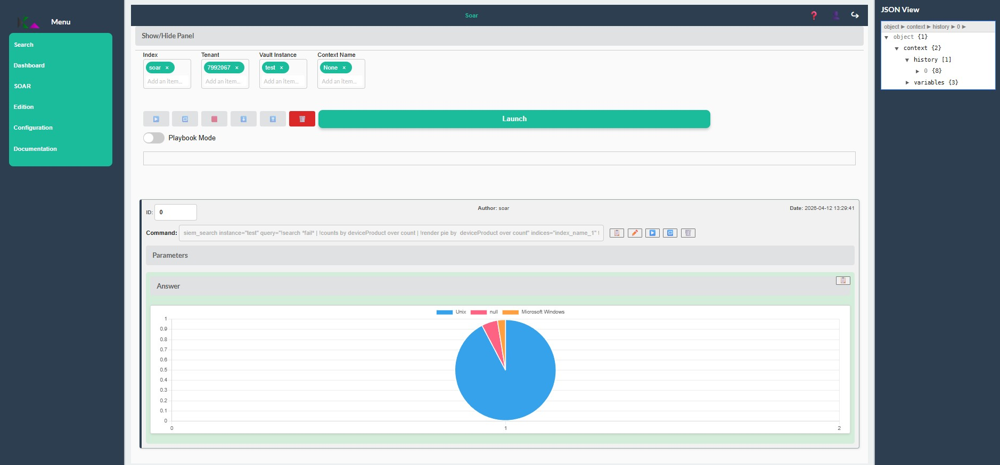
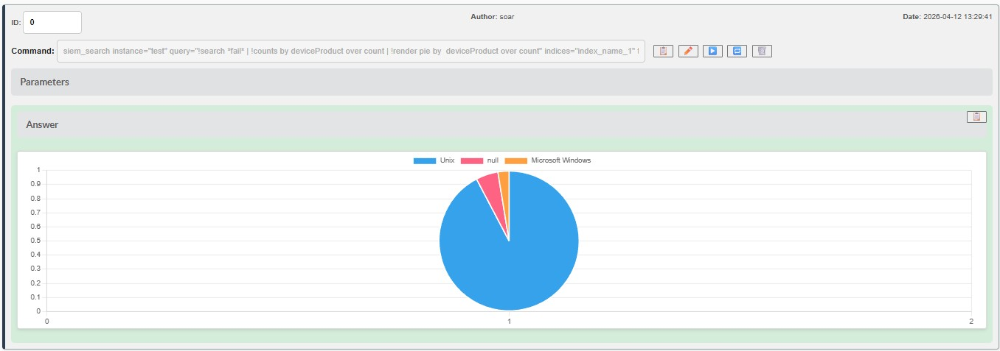

<!-- 
Copyright 2026 ttdantett DevBytesArt

Licensed under the Apache License, Version 2.0 (the "License");
you may not use this file except in compliance with the License.
You may obtain a copy of the License at

    http://www.apache.org/licenses/LICENSE-2.0

Unless required by applicable law or agreed to in writing, software
distributed under the License is distributed on an "AS IS" BASIS,
WITHOUT WARRANTIES OR CONDITIONS OF ANY KIND, either express or implied.
See the License for the specific language governing permissions and
limitations under the License.

author: ttdantett
project: siem project
DOCUMENT: soar doc
-->

# SOAR Page



The page is organised as it:

- Show/Hides panel
- Index
- Tenant
- Vault Instance
- Context Name
- Panel of buttons
- JSON View Context (on the right)
- Playbook slide
- Launch button
- Command input
- suggestions
- SOAR Cards

## Components of the page

It is possible to hide/display the search bar with the button "Show/Hide Panel".

All data are stored on only one index. Indices are physically or logically segregated each others. This is the main segregation of data. 

It could be several tenants in the index. Tenants are logically segregated. 

The vault instance is used to connect to a specific instance of an application, website or others SIEM components. Users require to have a specific resources access in the permission to access to the vault instance. 
**In order to find any playbook/context, the SOAR uses the vault instance permissions to launch commands and save in the context**

The Context name is the name of the context or the playbook. 

In order to search the context name, it is required to indicates the index, the tenant and the vault where it is stored. 

The panel of buttons can perform actions on the entire playbook/context:

- **Play all**: Launch or continue the playbook/context.
- **Replay all**: Reset all the cards (only for contexts) and relaunch the context.
- **Stop execution**: Stop the execution at the next command.
- **Import**: Import json playbook/context in the context/playbook.
- **Export**: Export json playbook/context in the context/playbook.
- **Delete all**: Delete all the commands added in the context/playbook.
- **Launch button**: When a command is present in the command bar, it add a new command at end of the context/playbook.

The commands input can provide suggestions when it is selected. When the user enter the first letter of a command, the suggestions can help the user to select any existing and available command. When a command is selected or the name completely entered, the suggestions provides parameters help, default value, type and descriptions to help the user.

When entering the command and click on launch, the command is sent to the SOAR serveur that executes the commands and return the results which is displayed in a SOAR Card at the center of the screen. 

**In the configuration file, plan enough time for the frequency for the locindex to save data in the index**. The synchronization is synchron for now. It should be changed in nexts versions. 

## SOAR Cards

The SOAR cards are used to display results of the commands and can be of several type (texte, json or graphics). Each commands can replayed, modified, erased or swap with another one. 



Button available on the cards applied only the selected cards and enable the copy, paste, modify, play and replay or delete.

The play continue the commands if the SOAR cards is in waiting status. 

Id of the SOAR cards is on the top left and can be modified to swap or drag and drop to swap is also possible. 

The command input is disabled by default but can be enable to click on the modify command. The command is only taken into account when you play the command to save the new command on the playbook/context. 

The author and date are also displayed on the top of the SOAR Cards. 

It is possible to see and modify the parameters by the expandable button. 

The results can be also hide and displayed by clicking on the button. 

## Create commands

In order to create others commands, the configuration file of the SOAR requests the folder where the python commands are set. 

New commands requires to add a new file in the folder and add the python fonction. 

After adding the python file, it is required to launch the command:

```
soar_reload_functions
```

This function will delete the list of commands saved in the soar and reload it to add new one.

**Be careful when add new functions as it can create errors during the download and block the loading of the functions**

**It is recommended to use the key_word of the python script at the beginning of the function, to find easier the command: ex: siem_<command>, soar_<command>, schedule_<command>**

## Context history

The history of the context/playbook contains all data such as variables (next task to play,  status of the playbook, ...), task request, task results and historic of results as the data are stored in an array. 

The history is used to export, import, save, load or display the context of the playbook/context. This is the data at the center of the playbook/context and is in read only as the mandatory data are indexed in the SIEM where the SOAR will save and load modification. 

## Playbook/Context

The main difference between playbook and context is that the playbook won't launch the command, but return a null results and the context will execute the command and return the results to the SOAR Cards. The playbook when launch will create a context and save the context on depending on the date of launch or the specific name of the results context.

Note that if a new_context_name is defined, each loop in the playbook will save into the same context and ovveride the results by the new one. However, it is still possible to find the old results in the historic in json to be used in another task. If this field is not defined, a default name will be affected based on the date of the launch and each loop will create another instance of the context.

## Formular

In order to use formular, the user can use the command:

```
soar_formular
```

The command is put by default on waiting status in order to wait the entry of the user due to the parameter "completed".
By default, if the answer is empty the parameter "completed" is False and when the user answer the parameter "completed" pass to True and the soar card is completed too. 
The user can only answer to the formular on context and not playbook. 

In order there is several questions to answer in the context, add a playbook inside the context:
```
soar_play_playbook
```
In this case, to answer the user must click on the link to open the formular and complete the commands. However, **the command on the current playbook must be launched manually to continue.**. 


## Scheduled tasks

**In order to use scheduled task, the user scheduler must be configured (specially in the vault) on the authenticator as the scheduler will use this default user to load pending scheduled task**.

When the SOAR is started, it will launch the scheduled task registered in the index and tenant of the SOAR but with the vault scheduler. All tasks enabled will be relaunched to continue the scheduled task.

In order to create a scheduled task, use the command of the SOAR:
```
schedule_task
```
But it is advised to schedule a playbook with the command:
```
schedule_playbook
```
The scheduler will add in the index the new playbook or task to launch it based on the frequency defined in the command. 

## Rules creation (alerts and incidents)

There is no obligation in the way to create alerts and incidents as alerts and incidents are only a way to categorise a search results. However, alerts and incidents can be manage as this:

- create a playbook with a search requests to create the detection rule (search and enrichment and other actions) and add it in a tenant "alert" or directly in "incident"
- if incident it is possible to add actions directly in this playbook
- schedule the playbook to launch the detection rule regularly
- create another playbook to match alerts that create incidents and store it in "incident" tenant.
- Schedule the playbook to launch post actions. 
- Open the SOAR and search for the right context to see the result of the alert or display it directly with the dashboard.

As you can see, alerts and incidents are only a nomenclature as the playbook is the core of the detection system and the SOAR detection and action is totally customisable according to the user want it. 

It is also possible to launch in a unique playbook all detection rules and create another playbook for incidents. 

And so on... 

### Rule creation

As precised in the previous section, the rule creation is done in a playbook with the command:
```
detection_create_rule
```
This command create a rule stored in the tenant in order to keep an inventory of the rules and version somewhere. 

Then use the command:
```
detection_create_alert
```
in order to launch the command search based on the name of the detection rule or use the search command but this command will create and store an alert in the index. 

If required, it is possible to launch others commands to enrich the alert or launch other incident response.

### Rule scheduling

Create a schedule task with the playbook previously created and enable it for the rule to be launch at a regular basis. 

### Display alerts

In order to display alerts, there is two possibilities:

1. Open the soar context and results of the rules. 
2. Create a specific dashboard to display charts about the results. 

Note that it is possible to display dashboards directly in the SOAR Card. 

### Create incidents

TO BE COMPLETED